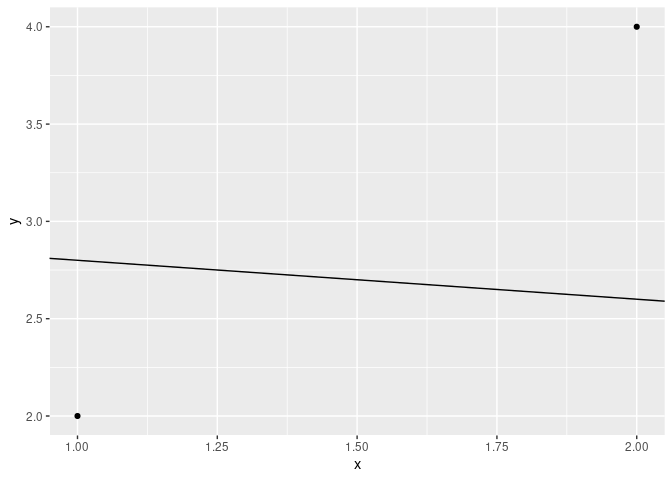
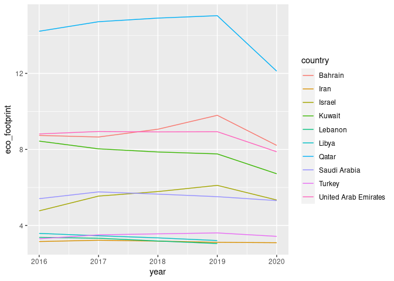
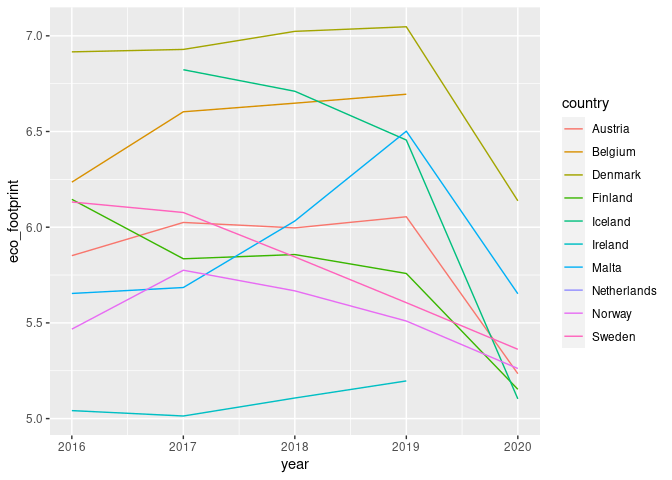
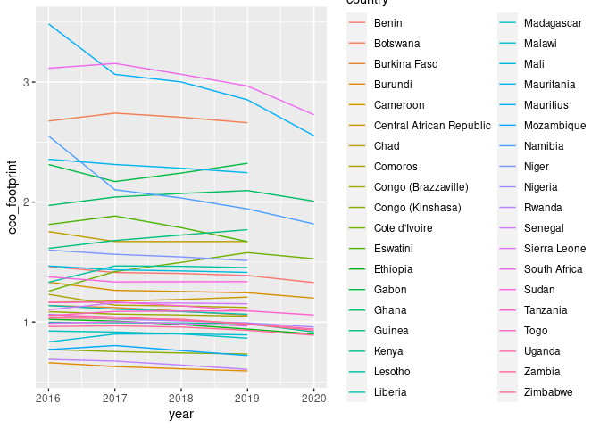

Project_Research
================
MZM
2021-12-01

    ## ── Attaching packages ─────────────────────────────────────── tidyverse 1.3.1 ──

    ## ✓ ggplot2 3.3.5     ✓ purrr   0.3.4
    ## ✓ tibble  3.1.3     ✓ dplyr   1.0.7
    ## ✓ tidyr   1.1.3     ✓ stringr 1.4.0
    ## ✓ readr   2.0.0     ✓ forcats 0.5.1

    ## ── Conflicts ────────────────────────────────────────── tidyverse_conflicts() ──
    ## x dplyr::filter() masks stats::filter()
    ## x dplyr::lag()    masks stats::lag()

    ## 
    ## Attaching package: 'janitor'

    ## The following objects are masked from 'package:stats':
    ## 
    ##     chisq.test, fisher.test

    ## 
    ## Attaching package: 'scales'

    ## The following object is masked from 'package:purrr':
    ## 
    ##     discard

    ## The following object is masked from 'package:readr':
    ## 
    ##     col_factor

    ## Registered S3 method overwritten by 'tune':
    ##   method                   from   
    ##   required_pkgs.model_spec parsnip

    ## ── Attaching packages ────────────────────────────────────── tidymodels 0.1.3 ──

    ## ✓ broom        0.7.9      ✓ rsample      0.1.0 
    ## ✓ dials        0.0.9      ✓ tune         0.1.6 
    ## ✓ infer        0.5.4      ✓ workflows    0.2.3 
    ## ✓ modeldata    0.1.1      ✓ workflowsets 0.1.0 
    ## ✓ parsnip      0.1.7      ✓ yardstick    0.0.8 
    ## ✓ recipes      0.1.16

    ## ── Conflicts ───────────────────────────────────────── tidymodels_conflicts() ──
    ## x broom::bootstrap() masks modelr::bootstrap()
    ## x scales::discard()  masks purrr::discard()
    ## x dplyr::filter()    masks stats::filter()
    ## x recipes::fixed()   masks stringr::fixed()
    ## x dplyr::lag()       masks stats::lag()
    ## x yardstick::mae()   masks modelr::mae()
    ## x yardstick::mape()  masks modelr::mape()
    ## x yardstick::rmse()  masks modelr::rmse()
    ## x yardstick::spec()  masks readr::spec()
    ## x recipes::step()    masks stats::step()
    ## • Use tidymodels_prefer() to resolve common conflicts.

    ## Warning in eval(substitute(list(...)), `_data`, parent.frame()): NAs introduced
    ## by coercion

``` r
hpi_data %>%
  ggplot(aes(x = gdp, y = life_exp, colour = region)) +
  geom_point() +
  facet_wrap(~year) +
  labs(
    title = "GDP and life expectancy around the world",
    subtitle = "Over time",
    x = "GDP per capaita (in thousands)",
    y = "Life expectancy",
    region = "Region"
  ) +
  theme(legend.position = "bottom") +
  scale_x_continuous(labels = label_dollar(scale = 0.001,
                                           prefix = "$",
                                           suffix = "K"))
```

    ## Warning: Removed 167 rows containing missing values (geom_point).

<!-- -->

``` r
hpi_data %>%
  filter(year != 2020) %>%
  ggplot(aes(x = gdp, y = hpi, colour = region)) +
  geom_point(alpha = 0.3)
```

    ## Warning: Removed 36 rows containing missing values (geom_point).

<!-- -->

``` r
hpi_data %>%
  filter(year != 2020) %>%
  ggplot(aes(x = gdp, y = happy_life_years, color = region)) +   geom_point() +
  facet_wrap(~year)
```

    ## Warning: Removed 32 rows containing missing values (geom_point).

<!-- -->

``` r
summarised_gdp_hpi <- hpi_data %>%
  filter(year != 2020) %>%
  group_by(country, region) %>%
  summarise(avg_gdp = median(gdp), 
            avg_life_years = mean(happy_life_years, 
                                  rm.na = TRUE))
```

    ## `summarise()` has grouped output by 'country'. You can override using the `.groups` argument.

``` r
summarised_gdp_hpi %>%
  ggplot(aes(x = avg_gdp, y = avg_life_years, 
             colour = region)) +
  geom_point() +
  geom_smooth(method = "lm", 
              formula = y~x,
              se =  FALSE,
              colour = "black") +
  facet_wrap(~region, nrow = 2) +
  theme(legend.position = "bottom")
```

    ## Warning: Removed 13 rows containing non-finite values (stat_smooth).

    ## Warning: Removed 13 rows containing missing values (geom_point).

<!-- -->

``` r
gdp_hpi_SA <- summarised_gdp_hpi %>%
  filter(region == "South Asia")

linear_reg() %>%
  set_engine("lm") %>%
  fit(avg_life_years ~ avg_gdp, data = gdp_hpi_SA) %>%
  tidy()
```

    ## # A tibble: 2 × 5
    ##   term         estimate std.error statistic p.value
    ##   <chr>           <dbl>     <dbl>     <dbl>   <dbl>
    ## 1 (Intercept) 27.7       5.35         5.19  0.00656
    ## 2 avg_gdp      0.000517  0.000818     0.633 0.561

``` r
gdp_hpi_EECA <- summarised_gdp_hpi %>%
  filter(region == "Eastern Europe & Central Asia")

linear_reg() %>%
  set_engine("lm") %>%
  fit(avg_life_years ~ avg_gdp, data = gdp_hpi_EECA) %>%
  tidy()
```

    ## # A tibble: 2 × 5
    ##   term         estimate std.error statistic  p.value
    ##   <chr>           <dbl>     <dbl>     <dbl>    <dbl>
    ## 1 (Intercept) 34.0      1.50          22.7  3.40e-18
    ## 2 avg_gdp      0.000389 0.0000636      6.12 2.12e- 6

``` r
gdp_hpi_ME <- summarised_gdp_hpi %>%
  filter(region == "Middle East")

linear_reg() %>%
  set_engine("lm") %>%
  fit(avg_life_years ~ avg_gdp, data = gdp_hpi_ME) %>%
  tidy()
```

    ## # A tibble: 2 × 5
    ##   term         estimate std.error statistic  p.value
    ##   <chr>           <dbl>     <dbl>     <dbl>    <dbl>
    ## 1 (Intercept) 32.4      1.92          16.9  1.03e-10
    ## 2 avg_gdp      0.000352 0.0000622      5.66 5.90e- 5

``` r
gdp_hpi_LA <- summarised_gdp_hpi %>%
  filter(region == "Latin America")

linear_reg() %>%
  set_engine("lm") %>%
  fit(avg_life_years ~ avg_gdp, data = gdp_hpi_LA) %>%
  tidy()
```

    ## # A tibble: 2 × 5
    ##   term         estimate std.error statistic  p.value
    ##   <chr>           <dbl>     <dbl>     <dbl>    <dbl>
    ## 1 (Intercept) 37.9       2.80         13.5  1.55e-10
    ## 2 avg_gdp      0.000520  0.000174      2.98 8.38e- 3

``` r
gdp_hpi_NAO <- summarised_gdp_hpi %>%
  filter(region == "North America & Oceania")

linear_reg() %>%
  set_engine("lm") %>%
  fit(avg_life_years ~ avg_gdp, data = gdp_hpi_NAO) %>%
  tidy()
```

    ## # A tibble: 2 × 5
    ##   term         estimate std.error statistic p.value
    ##   <chr>           <dbl>     <dbl>     <dbl>   <dbl>
    ## 1 (Intercept) 74.4       5.22         14.3  0.00489
    ## 2 avg_gdp     -0.000316  0.000103     -3.07 0.0918

``` r
gdp_hpi_WE <- summarised_gdp_hpi %>%
  filter(region == "Western Europe")

linear_reg() %>%
  set_engine("lm") %>%
  fit(avg_life_years ~ avg_gdp, data = gdp_hpi_WE) %>%
  tidy()
```

    ## # A tibble: 2 × 5
    ##   term         estimate std.error statistic  p.value
    ##   <chr>           <dbl>     <dbl>     <dbl>    <dbl>
    ## 1 (Intercept) 48.4      3.23          15.0  1.31e-11
    ## 2 avg_gdp      0.000157 0.0000572      2.74 1.34e- 2

``` r
gdp_hpi_A <- summarised_gdp_hpi %>%
  filter(region == "Africa")

linear_reg() %>%
  set_engine("lm") %>%
  fit(avg_life_years ~ avg_gdp, data = gdp_hpi_A) %>%
  tidy()
```

    ## # A tibble: 2 × 5
    ##   term         estimate std.error statistic  p.value
    ##   <chr>           <dbl>     <dbl>     <dbl>    <dbl>
    ## 1 (Intercept) 24.9       0.928        26.9  4.90e-23
    ## 2 avg_gdp      0.000538  0.000137      3.93 4.47e- 4

``` r
gdp_hpi_EA <- summarised_gdp_hpi %>%
  filter(region == "East Asia")

linear_reg() %>%
  set_engine("lm") %>%
  fit(avg_life_years ~ avg_gdp, data = gdp_hpi_EA) %>%
  tidy()
```

    ## # A tibble: 2 × 5
    ##   term         estimate std.error statistic  p.value
    ##   <chr>           <dbl>     <dbl>     <dbl>    <dbl>
    ## 1 (Intercept) 37.9      1.84          20.6  1.01e-10
    ## 2 avg_gdp      0.000176 0.0000515      3.42 5.10e- 3

``` r
df <- data_frame(x = c(1,2), y = c(2,4))
```

    ## Warning: `data_frame()` was deprecated in tibble 1.1.0.
    ## Please use `tibble()` instead.
    ## This warning is displayed once every 8 hours.
    ## Call `lifecycle::last_warnings()` to see where this warning was generated.

``` r
ggplot(df, aes(x = x, y = y)) +
  geom_point() +
  geom_abline(aes(slope = -0.2,intercept = 3))
```

<!-- -->

``` r
hpi_middle_east <- filter(hpi_data, region == "Middle East", eco_footprint > 3)

ggplot(data = hpi_middle_east, aes(x = year, y = eco_footprint, colour = country))+
  geom_line()
```

<!-- -->

``` r
hpi_western_europe <- filter(hpi_data, region == "Western Europe", eco_footprint > 5, eco_footprint < 9)

ggplot(data = hpi_western_europe, aes(x = year, y = eco_footprint, colour = country))+
  geom_line()
```

<!-- -->

``` r
hpi_africa <- filter(hpi_data, region == "Africa")

ggplot(data = hpi_africa, aes(x = year, y = eco_footprint, colour = country))+
  geom_line()
```

    ## Warning: Removed 24 row(s) containing missing values (geom_path).

<!-- -->
