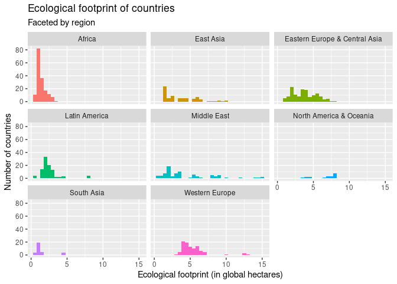

Project proposal
================
MZM

``` r
library(tidyverse)
library(broom)
library(readxl)
library(janitor)
library(scales)
```

## 1. Introduction

In our project we aim to show how different countries compare against
one another in multiple variables, one of which being the ‘Happy Planet
Index’. This will help us understand which regions or countries are able
to provide a good living standard while also having a healthy
environmental footprint. Our data is from a data set named the ‘Happy
Planet Index’ which has taken most countries and used their social
happiness, environmental impact and also inequalities and differences of
the countries people. Some important variables to know are the ‘Happy
Planet Index’ which is a combination of a countries inequalities of
living, their environmental impact and their peoples happiness. ‘Eco
Footprint’ is the average demand for the natural resources of the
environment, so how much land and resources would be needed to sustain
the country. ‘Biocapacity’ is the average wellbeing reported by the
citizens of a country, measured through a survey in which people ranked
their wellbeing from 1 to 10. The data set was compiled using many open
polls and data sets from the UN, York University and others.

## 2. Data

    ## Warning in eval(substitute(list(...)), `_data`, parent.frame()): NAs introduced
    ## by coercion

``` r
glimpse(hpi_data)
```

    ## Rows: 760
    ## Columns: 12
    ## $ hpi_rank      <dbl> 1, NA, 3, 8, 2, 6, 10, 4, 9, NA, 12, 21, 13, 23, 20, 7, …
    ## $ country       <chr> "Costa Rica", "Vanuatu", "Colombia", "Switzerland", "Ecu…
    ## $ iso           <chr> "CRI", "VUT", "COL", "CHE", "ECU", "PAN", "JAM", "GTM", …
    ## $ region        <chr> "Latin America", "East Asia", "Latin America", "Western …
    ## $ pop_1000s     <dbl> 4899.336, 278.326, 48175.048, 8379.915, 16491.116, 4037.…
    ## $ life_exp      <dbl> 79.7, 70.0, 76.7, 83.3, 76.4, 78.0, 74.2, 73.5, 74.7, 77…
    ## $ wellbeing     <dbl> 7.135618, 6.712810, 6.233715, 7.458520, 6.115438, 6.1176…
    ## $ eco_footprint <dbl> 2.7101425, NA, 2.0414124, 4.6007449, 1.6910607, 2.260211…
    ## $ hpi           <dbl> 62.37983, NA, 58.14679, 56.11938, 59.53255, 56.93162, 55…
    ## $ biocapacity   <dbl> 1.6, 1.6, 1.6, 1.6, 1.6, 1.6, 1.6, 1.6, 1.6, 1.6, 1.6, 1…
    ## $ gdp           <dbl> 19211.567, 3061.787, 14242.807, 66344.075, 11551.617, 29…
    ## $ year          <dbl> 2016, 2016, 2016, 2016, 2016, 2016, 2016, 2016, 2016, 20…

## 3. Data analysis plan

``` r
hpi_data %>%
  ggplot(aes(x = year, y = wellbeing, group = year)) +
  geom_violin(trim = FALSE) +
  facet_wrap(~region) +
  labs(
    title = "Wellbeing around the world",
    subtitle = "Over time",
    x = "Years",
    y = "Wellbeing measure"
  )
```

    ## Warning: Removed 75 rows containing non-finite values (stat_ydensity).

<!-- -->

``` r
hpi_data %>%
  ggplot(aes(x = gdp, y = wellbeing, group = year)) +
  geom_line(trim = FALSE) +
  facet_wrap(~region) +
  labs(
    title = "Wellbeing around the world",
    subtitle = "Over time",
    x = "Years",
    y = "Wellbeing measure"
  )
```

    ## Warning: Ignoring unknown parameters: trim

    ## Warning: Removed 152 row(s) containing missing values (geom_path).

<!-- -->

``` r
hpi_data %>%
  ggplot(aes(x = life_exp, y = wellbeing, group = year)) +
  geom_point(trim = FALSE) +
  facet_wrap(~region) +
  labs(
    title = "Wellbeing around the world",
    subtitle = "Over time",
    x = "Life Expectancy",
    y = "Wellbeing measure"
  )
```

    ## Warning: Ignoring unknown parameters: trim

    ## Warning: Removed 81 rows containing missing values (geom_point).

<!-- -->

``` r
library(viridis)
```

    ## Loading required package: viridisLite

    ## 
    ## Attaching package: 'viridis'

    ## The following object is masked from 'package:scales':
    ## 
    ##     viridis_pal

``` r
library(gganimate)
```

    ## No renderer backend detected. gganimate will default to writing frames to separate files
    ## Consider installing:
    ## - the `gifski` package for gif output
    ## - the `av` package for video output
    ## and restarting the R session

``` r
hpi_data_clean <- na.omit(hpi_data)

p <- ggplot(
  hpi_data_clean, 
  aes(x = wellbeing, y=life_exp, size = pop_1000s, colour = country)
  ) +
  geom_point(show.legend = FALSE, alpha = 0.7) +
  scale_color_viridis(name= "country", discrete = TRUE) +
  scale_size(range = c(2, 12)) +
  scale_x_log10() +
  guides(colour = guide_legend(order = 2), shape = guide_legend(order = 1)) +
  theme_void() + 
    theme(legend.position = "bottom", legend.box = "vertical", legend.title.align = 0) +
    theme(plot.title = element_text(hjust = 0.5, vjust = 0.05)) +
    theme(plot.caption = element_text(hjust = 0, color="gray40", size=10)) +
  labs(x = "Wellbeing", y = "Life Expectancy")

animation<- p + transition_states(year,
                              transition_length = 2,
                              state_length = 1)
animation
```

    ## Warning: No renderer available. Please install the gifski, av, or magick package
    ## to create animated output

    ## NULL

``` r
library(reprex)
file_renderer(dir = ".", prefix = "gganim_plot", overwrite = FALSE)
```

    ## function (frames, fps) 
    ## {
    ##     if (!dir.exists(dir)) 
    ##         dir.create(dir, showWarnings = FALSE, recursive = TRUE)
    ##     new_names <- file.path(dir, sub("gganim_plot", prefix, basename(frames)))
    ##     if (any(!file.copy(frames, new_names, overwrite = overwrite))) {
    ##         warning("file_renderer failed to copy frames to the destination directory", 
    ##             call. = FALSE)
    ##     }
    ##     invisible(new_names)
    ## }
    ## <bytecode: 0x564d124fc0a8>
    ## <environment: 0x564d0f1088f0>

It is clear from the graph that people in north america and oceania are
the happiest about their wellbeing standards and that south asia seems
very varied but also the least content. There doesn’t seem to be a clear
impact from COVID in the wellbeing of countries.

``` r
hpi_data %>%
  ggplot(aes(x = gdp, y = life_exp, colour = region)) +
  geom_point() +
  facet_wrap(~year) +
  labs(
    title = "GDP and life expectancy around the world",
    subtitle = "Over time",
    x = "GDP per capaita (in thousands)",
    y = "Life expectancy",
    region = "Region"
  ) +
  theme(legend.position = "bottom") +
  scale_x_continuous(labels = label_dollar(scale = 0.001,
                                           prefix = "$",
                                           suffix = "K"))
```

    ## Warning: Removed 167 rows containing missing values (geom_point).

<!-- --> As we
can see there is a clear relationship between life expectancy and GDP,
countries with higher life expectancy also tend to have higher GDP’s.
Most countries with low GDP’s and low life expectancy are in africa
meanwhile western europe holds many of the top spots. There isnt much
change year to year.

``` r
hpi_data %>%
  ggplot(aes(x = eco_footprint, fill = region)) +
  geom_histogram() +
  facet_wrap(~region) +
  labs(
    title = "Ecological footprint of countries",
    subtitle = "Faceted by region",
    x = "Ecological footprint (in global hectares)",
    y = "Number of countries"
  ) +
  theme(legend.position = "none")
```

    ## `stat_bin()` using `bins = 30`. Pick better value with `binwidth`.

    ## Warning: Removed 48 rows containing non-finite values (stat_bin).

<!-- --> The graphs
show the ecological footprint of each country 5 times for each year. We
can see that Africa has a very low ecological footprint in general
likely due to low rates of industrialisation. The middle east has the
highest ecological footprint countries and the lowest simultaneously,
this could be due to some countries being heavily industrialised and
others having vast deserts with no ecological footprint.

We have analysed our data through three categories: geographic, economic
and mental health. The first category contains variables on general well
being of the population. our second category obtainslife expactancyand
GDP per capita. Lastly, our third category has information on ecological
footprint based on their location (continent).

We will examine the changes within these three categories through years
2016 to 2020 and compare specifically years 2016-2019 and 2020 to
understand the effects of the pandemic on the countries’ happy planet
indexes.

Method: We are planning on taking the average of values of data tables
from years 2016 to 2019 and creating another table. Comparing the new
data frame, containing the averages of all values for the necessary
variables, with values of 2020 will give us a more reliable
difference/change due to the pandemic. Our analysis will contain three
graphs (one for each category) with all the necessary variables.

Conclusion: We expect decrease in mental health and economic factors due
to the pandemic.
